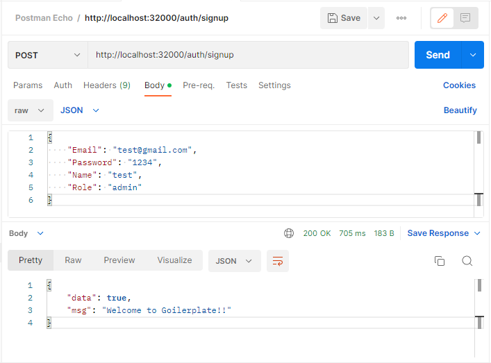
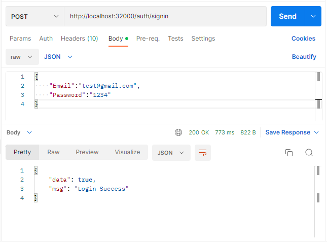
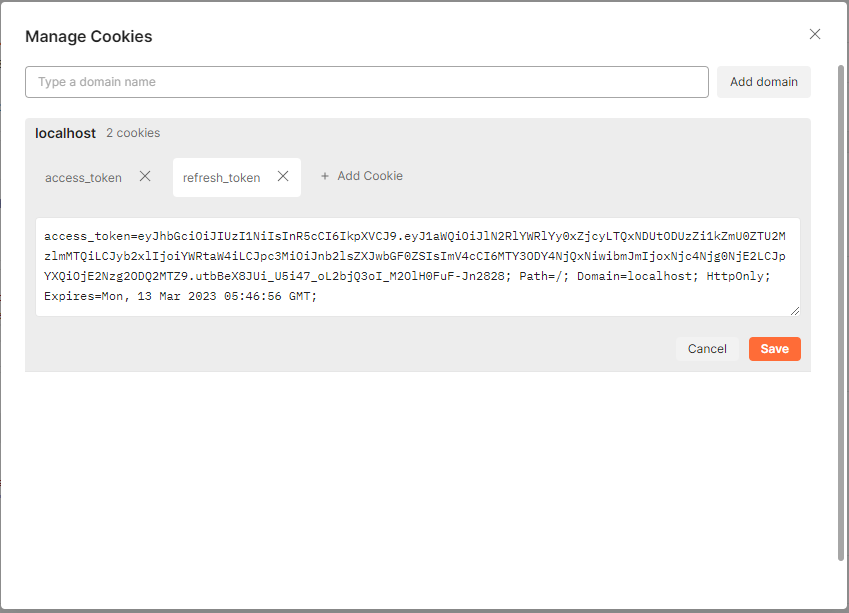
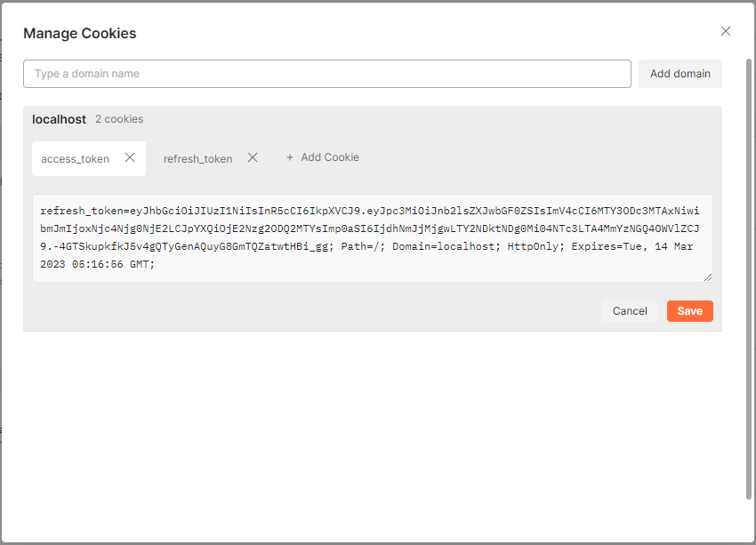
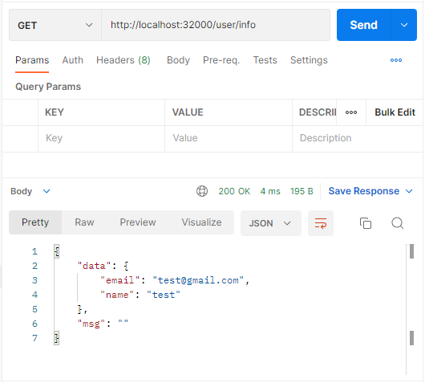

<h1 align="center">
  <b>Goilerplate</b>
</h1>

  For the perfect structure. 🔥🔥🔥

## Contents
- [Implemented Features](#implemented-features)
- [Kubernetes](#kubernetes)
  - [api.yml](#apiyml)
  - [postgres.yml](#postgresyml)
  - [pgadmin4.yml](#pgadmin4yml)
  - [redis.yml](#redisyml)
- [Quick start](#quick-start)
  - [Docker-Compose Infra](#docker-compose-infra)
  - [Kubernetes Infra](#kubernetes-infra)
- [Auth API](#auth-api-postman-tool)
  - [SignUp](#signup)
  - [SignIn](#signin)
  - [User Info](#user-info)

## Implemented Features
-   <b>Routing</b> - Gin Web Framework ----------------------------[📚](https://gin-gonic.com/docs) [:octocat:](https://github.com/gin-gonic/gin)

-   <b>CLI</b> - Cobra -------------------------------------------------[📚](https://cobra.dev) [:octocat:](https://github.com/spf13/cobra)

-   <b>Dependency Injection</b> - Fx --------------------------------[📚](https://uber-go.github.io/fx/get-started) [:octocat:](https://github.com/uber-go/fx)

-   <b>Environment</b> - Viper ---------------------------------------[:octocat:](https://github.com/spf13/viper)

-   <b>Logging</b> - Zap ----------------------------------------------[:octocat:](https://github.com/uber-go/zap)

-   <b>PostgreSQL</b> - GORM ---------------------------------------[📚](https://gorm.io/docs) [:octocat:](https://github.com/go-gorm/gorm)

-   <b>Redis</b> - Go-Redis -------------------------------------------[📚](https://redis.uptrace.dev/guide) [:octocat:](https://github.com/go-redis/redis)

-   <b>DB Viewer</b> - pgAdmin4 (Web) -----------------------------[🐳](https://hub.docker.com/r/dpage/pgadmin4)

-   <b>Authentication</b> - JWT (Access + refresh) ------------------[:octocat:](https://github.com/golang-jwt/jwt)

## Kubernetes
#### [api.yml](./k8s/api.yml)
- Deployment 
- Service

#### [postgres.yml](./k8s/postgres.yml)
- Deployment
- ConfigMap
- Service
- PersistentVolume
- PersistentVolumeClaim

#### [pgadmin4.yml](./k8s/pgadmin4.yml)
- Deployment
- ConfigMap
- Service

#### [redis.yml](./k8s/redis.yml)
- Deployment
- Service
- PersistentVolume
- PersistentVolumeClaim

## Quick start
#### Docker-Compose Infra
- Make sure you have docker installed.
- Copy `/env/stage.env` to `.env`
- Run `docker-compose up -d`
  - API Host: localhost:5000
    - [POST] auth/signup
    - [POST] auth/signin
    - [GET] user/info
  - DB Viewer Host: localhost:8080
    - Email: user@goilerplate.com - PW: 1234

#### Kubernetes Infra
- Make sure you have kubectl(Kubernetes) installed. 
- Run `kubectl apply -f .\k8s\`
  - API Host: localhost:32000
    - [POST] auth/signup
    - [POST] auth/signin
    - [GET] user/info
  - DB Viewer Host: localhost:30080
    - Email: user@goilerplate.com - PW: 1234

## Auth API (Postman Tool)
#### - SignUp
</img>

#### - SignIn
</img>
</img>
</img>

#### - User Info
</img>